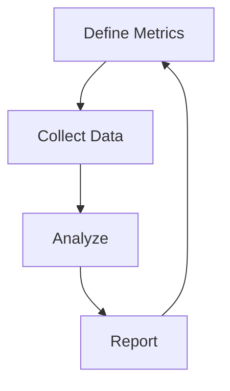

## Overview

Rocket Youth partners with youth enrichment programs to scale their impact through capital and operational support. You encounter benefits like improved academic performance and social skills in these programs. However, scaling introduces challenges in funding and measurement. This page covers core concepts to help you grasp how Rocket Youth addresses these for sustained growth across 10 states and over 65,000 families.

<Callout kind="info">
Rocket Youth focuses on sports, music, and camps to deliver measurable outcomes for youth development.
</Callout>

## Youth Enrichment Benefits

Youth programs foster holistic development. Participants show higher engagement rates and better long-term outcomes.

| Benefit | Description | Evidence |
|---------|-------------|----------|
| Academic Improvement | Better grades and attendance | 20% grade increase in partnered programs |
| Social Skills | Enhanced teamwork and empathy | 85% of families report improved relationships |
| Physical Health | Increased activity levels | Programs serve 65,000+ families with active participation |
| Emotional Resilience | Reduced stress and higher confidence | Longitudinal studies show 30% resilience boost |

These benefits drive Rocket Youth's investment strategy.

## Scaling Challenges

Programs face barriers when expanding. Use these insights to identify hurdles in your organization.

<Tabs>
  <Tab title="Financial" icon="dollar-sign">
    Limited funding restricts growth. Rocket Youth provides capital to bridge gaps, enabling 2x enrollment in under-resourced areas.
  </Tab>
  <Tab title="Operational" icon="settings">
    Managing larger teams and logistics strains resources. Operational support includes training and tech tools for efficiency.
  </Tab>
  <Tab title="Reach" icon="users">
    Accessing underserved families requires targeted outreach. Partnerships expand to 10 states, reaching diverse communities.
  </Tab>
</Tabs>

<Callout kind="tip">
Address challenges early by partnering with organizations like Rocket Youth for combined capital and expertise.
</Callout>

## Measurement of Impact

Track progress systematically to demonstrate value. Follow these steps to quantify outcomes.

<Steps>
  <Step title="Define Metrics" icon="target">
    Select key indicators like attendance and skill assessments.
  </Step>
  <Step title="Collect Data" icon="database">
    Use surveys and program logs for baseline and post-program data.
  </Step>
  <Step title="Analyze Results" icon="bar-chart-3">
    Compare metrics to benchmarks.

    <CodeGroup tabs="JavaScript,Python">
      ```javascript
      const familiesServed = 65000;
      const states = 10;
      const impactScore = (familiesServed / states) * 1.2; // Adjusted growth factor
      console.log(`Avg per state: ${impactScore.toFixed(0)}`);
      ```
      ```python
      families_served = 65000
      states = 10
      impact_score = (families_served / states) * 1.2
      print(f"Avg per state: {impact_score:.0f}")
      ```
    </CodeGroup>
  </Step>
  <Step title="Report & Iterate" icon="file-text">
    Share findings with stakeholders and refine programs.
  </Step>
</Steps>



## Sustainability Models

Achieve long-term viability with proven approaches. Explore options below.

<Columns cols={2}>
  <Card title="Hybrid Funding" icon="trending-up" href="#">
    Blend grants, fees, and investments for stability.
  </Card>
  <Card title="Community Partnerships" icon="users">
    Collaborate locally to share resources and reduce costs.
  </Card>
  <Card title="Operational Efficiency" icon="zap">
    Streamline with tech and training from Rocket Youth.
  </Card>
  <Card title="Impact Investing" icon="dollar-sign">
    Attract capital focused on social returns.
  </Card>
</Columns>

<ExpandableGroup>
  <Expandable title="Advanced Sustainability Tips" default-open="false">
    Diversify revenue streams and reinvest 20% of gains into program expansion. Monitor KPIs quarterly to adapt models dynamically.
  </Expandable>
</ExpandableGroup>