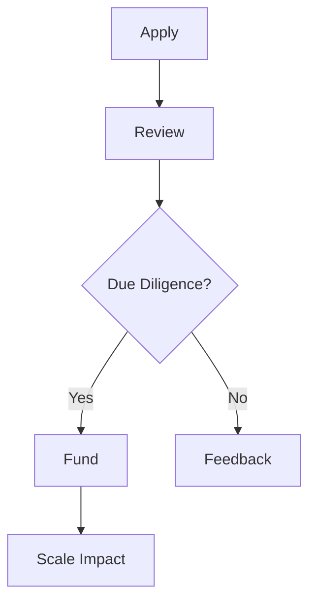

## Overview

Rocket Youth partners with youth enrichment and after-school programs to help you scale your impact. You receive capital investments and operational support to expand services like sports, music, and camps. With operations across 10 states and over 65,000 families served, our partnerships drive growth for organizations dedicated to youth development.

<Columns cols="2">
  <Card title="Capital Investment" href="#investment-opportunities" icon="dollar-sign" horizontal="false">
    Access funding to fuel expansion and infrastructure upgrades.
  </Card>

  <Card title="Operational Support" href="#operational-support" icon="settings" horizontal="false">
    Get expert guidance on program management and scaling.
  </Card>
</Columns>

## Partnership Process

Follow these steps to apply for a Rocket Youth partnership.

<Steps>
  <Step title="Review Eligibility" icon="check-circle" title-type="p">
    Ensure your program serves youth in enrichment areas like sports or arts. Operate in one of our 10 supported states.
  </Step>

  <Step title="Submit Application" icon="upload" title-type="p">
    Prepare your pitch deck and financials. Use our online portal.
  </Step>

  <Step title="Interview & Due Diligence" icon="search" title-type="p">
    Meet our team for a virtual review. We assess impact potential.
  </Step>

  <Step title="Agreement & Launch" icon="rocket" title-type="p">
    Sign terms and receive initial funding. Start scaling with our support.
  </Step>
</Steps>

<Callout kind="tip" collapsed="false">
  Prepare metrics on families served and program outcomes to strengthen your application.
</Callout>

## Investment Opportunities

Secure flexible capital to grow your program. Investments range from $50,000 to $500,000, tailored to your needs.



| Investment Type | Amount Range | Use Cases                    |
| --------------- | ------------ | ---------------------------- |
| Seed Funding    | $50K-$150K   | Program launch, equipment    |
| Growth Capital  | $150K-$500K  | Facility expansion, staffing |
| Bridge Funding  | $100K-$300K  | Seasonal scaling, pilots     |

## Operational Support Services

Access a suite of services to optimize operations.

<Tabs>
  <Tab title="Program Design" icon="edit-3">
    Refine curricula and enrollment strategies to boost participation.

    <Expandable title="Customization Options" default-open="false">
      Tailor support for sports, music, or camp formats.
    </Expandable>
  </Tab>

  <Tab title="Marketing & Enrollment" icon="megaphone">
    Develop campaigns to reach more families. Includes digital ads and community outreach.
  </Tab>

  <Tab title="Financial Management" icon="bar-chart-3">
    Implement budgeting tools and revenue diversification.

    ```javascript
    // Sample enrollment tracking dashboard snippet
    const metrics = {
      familiesServed: 1250,
      retentionRate: 0.87,
      growthYoY: 0.25
    };
    console.log(`Current impact: ${metrics.familiesServed} families`);
    ```
  </Tab>
</Tabs>

## Scaling Strategies

Implement proven tactics to expand reach.

<CodeGroup show-lines="true" tabs={[]}>
  ```markdown
  # Local Expansion Plan
  1. Add after-school slots
  2. Partner with local schools
  3. Hire part-time coaches
  ```

  ```markdown
  # Regional Growth Plan
  1. Open satellite locations
  2. Standardize curriculum
  3. Secure multi-year funding
  ```
</CodeGroup>

## Success Stories

<ExpandableGroup>
  <Expandable title="Soccer Stars Program" default-open="true">
    Expanded from 1 site to 5 across Texas, serving 2,000+ kids with $250K investment. Retention increased 40%.
  </Expandable>

  <Expandable title="Music Makers Camp" default-open="false">
    Scaled music workshops statewide in California. Reached 1,500 families using our marketing support.
  </Expandable>

  <Expandable title="Summer Adventure Sports" default-open="false">
    Grew from pilot to multi-state with operational tools. Impacted 3,000 youth.
  </Expandable>
</ExpandableGroup>

<Callout kind="success" collapsed="false">
  Join 50+ partners amplifying youth programs. Contact us to start your journey.
</Callout>

